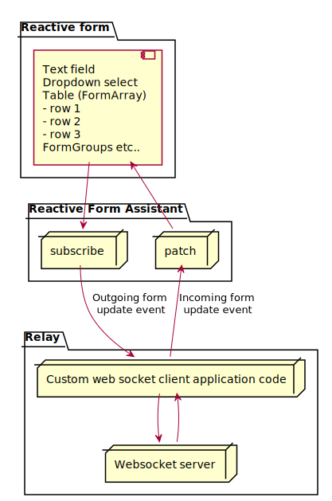

Reactive Forms Assistant
========================

The reactive form assistant adds a subscription to all controls in a reactive form and creates form update events. It can also consume incoming form update events and patch the affected controls. The primary use case is to enable real time collaboration on web forms.



# How to use

- Provide `ReactiveFormAssistant` to your component containing the reactive form
    ```
    @Component({ ... providers: [ ReactiveFormAssistant] })
    ```
- Connect the formgroup to the reactive form assistant: 
    ``` 
        this.reactiveFormAssistant.formGroup = this.formGroup;
        this.reactiveFormAssistant.controlsubscribe();
    ```
- Subscribe to `this.reactiveFormAssistant.formUpdatesSubject` to receive form update events that you can send to your relay.
- When a form update event is received from your relay call `this.reactiveFormAssistant.patchFormUpdateEvent(formUpdateEvent)`

# Limitations

[FormArrays](https://angular.io/api/forms/FormArray) may be tricky to synchronize. Given that changes are on existing rows, it may just be an update event on one form element. Adding or removing rows at the end of the list is also trivial, but reordering the rows require a bit more logistics that can easily go wrong. For simplicity the ReactiveFormAssistant provides a method to send the full array in the case of reordering. This works as long as all clients agree on the state of the array before the full reordered array is sent, otherwise receiving clients might loose their changes.